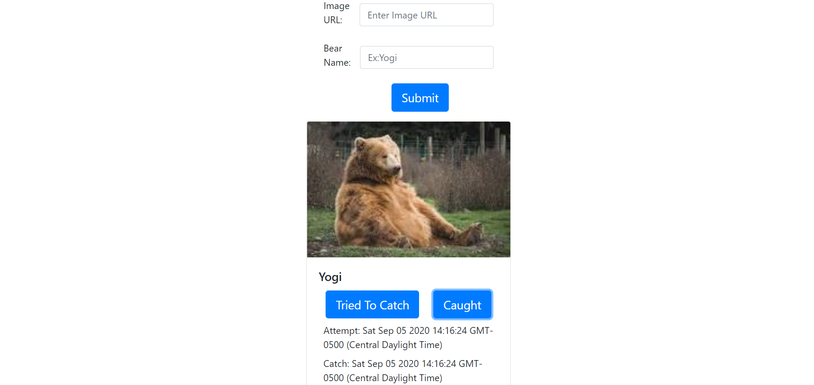

# Bear Tracker

## Motiviation
This was a project that was built to help a user report a bear sighting, add their own image, and track attempts that a bear tries to catch a fish!

### Tech Used
* ES6 JavaScript Modules
* JQuery 3.2.1

### Build Status

### Demo

### Site Link
[Bear Watcher](https://bearwatcherjm.netlify.app/)

